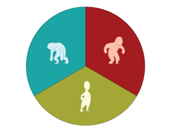

Moody Maize
===

A text-based room escape game about moods.

Global Game Jam Entry:
---

http://globalgamejam.org/2014/games/moody-maize

Jam Site: 
---

Eastern Kentucky University

Jam Year: 
---

2014

Diversifiers: 
---

I am who I want to be:The game has characters, but nothing in their design suggests a gender.

Platforms: 
---

Web standard (HTML5, Java, JavaScript, Flash)

Technology Notes: 
---

The game engine was crafted from scratch in Javascript during the Jam, aside from the graphics handler (custom-built by a team member and heavily modified during the Jam) and the use of JQuery and Google Fonts

Credits: 
---

Alex Mankin - Concept and Graphics Programming

Carter David Henning - Writing and Design

Olivia Hornback - Art and Design

Simon Mikulcik - Parser Programming

Play Now!: 
---

http://www.campfiresaga.net/ggj2014
